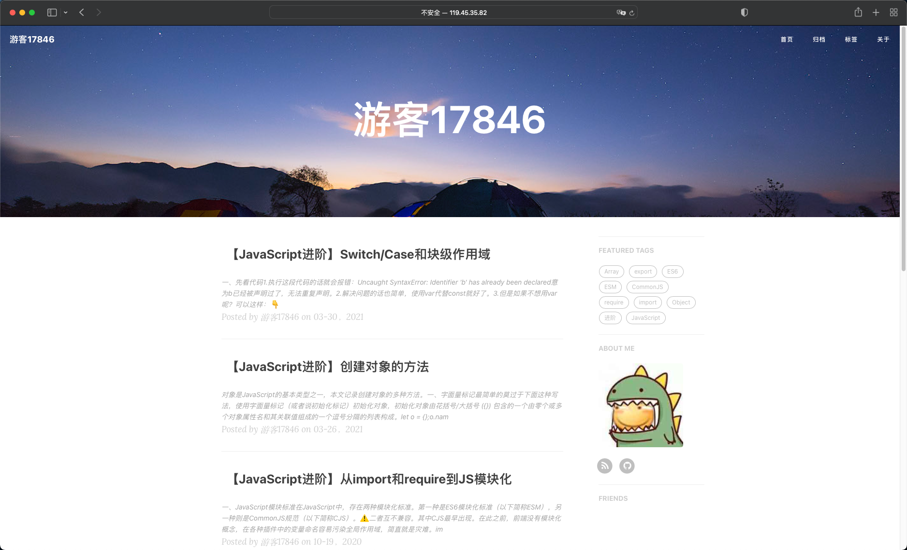

<h1><a href="https://github.com/StarlightUnion/halo-theme-hux-tourist" target="_blank">halo-theme-hux-tourist</a></h1>

## 说明

该主题的原作者为 [Xuan Huang](https://github.com/huxpro)，非常感谢做出这么优秀的主题。

原主题地址：[https://github.com/Huxpro/huxpro.github.io](https://github.com/Huxpro/huxpro.github.io)

## 预览截图

## 预览地址

[游客17846](https://tourist17846.cn/)

## 安装方法

### 方法一

1. 复制 `https://github.com/StarlightUnion/halo-theme-hux-tourist`。
2. 进入后台 -> 外观 -> 主题。
3. 点击右下方按钮选择安装主题，随后选择 `远程拉取`。
4. 粘贴复制的链接到远程地址，点击下载即可。

